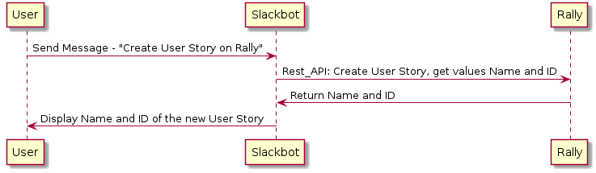

# Developer's Guide

## Interaction - Slackbot

The user interacts with a Slackbot to send commands to execute in rally. The commands can be evoked by sending a direct message to the bot or mentioning the bot with "@botname" followed by the commands. For details on the Slackbot API, see Slack Module Investigation. Below is a diagram of the behavior of the application.

User-end example:

## Bot Configuration

The configuration file is structured like this:

###### `*` indicates a mandatory key value

>*   slackbot*
>    * bot*
>    * slackBotKey*
>    * slackWebKey*
>*   config*
>    *  modules*
>       * [Module 1]
>       * [Module 2...]
>       * [Module n]
>    *  listens*
>       * [listens 1]
>       * [listens 2...]
>       * [listens n]

---
We will go through each section of the config file as well as the optional Modules and listens key values.

## Basic Structure

### slackbot

__slackbot__ is a mandatory key value which points to an object that contains `bot` and `key`.

* __bot__ is a mandatory key that points to the directory of the bot. The default directory is `./bot/bot`.
* __slackBotKey__ is a mandatory key that points to the Slackbot API key, obtained after making a Slackbot.
* __slackWebKey__

### config

__config__ is a mandatory key value which points to an object that contains `modules` and `listens`.

## modules
__modules__ is a mandatory key value which points to an object that contains custom modules. This object contains a key value and an to an object to indicate a module in the project. A module is structured like this:

      "moduleName": {
        "path": "/mandatory/path/to/module",
        "options": {
          "comment": "optional to pass static values like API keys",
          "apiKey": "abcdefg12345"
        },
        "loadIgnore": true
      }
* The `path` is a mandatory field that indicates the path of the module's index file. The index file should be located in `./lib/<moduleName>/<moduleName>`.
* `options` is a optional field which can be used to pass static values like API keys.
* `loadIgnore` can be `true` or `false`. It is used to indicate whether this module should be loaded upon command. This is the field for you if you want to customize your module path.

The built-in "capture" module is a default module for capturing undetected string.

__Loading__

After creating a key(name of your module) and adding `path` to the object in `config.json`, you can type `node index.js load`. The project manager will automatically create a directory and a few files in `lib/<moduleName>` for you to get started.

__Development__

Loading the module creates three files: `config.json`, `<moduleName>.js`, and `listens.js`. The `config.json` is used to contain all static elements like default chat responses - anything static. The `<moduleName>.js` is where the programming begins. This file returns an object of functions which gets triggered according to the `listens.js` configuration. The bot's behavior and API calls can be done in here. The bot and message properties are based off of howdy [Botkit](https://howdy.ai/botkit/).

`bot.reply(message, '<your message')` is your main command to

__Listens__

    "listens": {
        "rally": "./lib/rally/listens",
        "conv": "./lib/conv/listens",
        "capture": "./bot/capture/listens"
    }

The `listens.js` exports a two dimensional array that includes the module name, function name, and the detection regex. If a message matches the regex, the function in the module of the same array will be triggered. The listens file can be located anywhere as long as all of them are indicated in `config.json`. It can also be removed from the configuration file to individually test modules.

__The capture module should always be at the bottom of a listens object.__

# Workflow Summary

1. Add a module to your configure file

2. Type `node index.js load` into the console

3. Start making your module

4. Keep the `listens.js` file updated to your module

# Prebuilt API Samples

### Modules without APIs

__Capture__

The capture module is used to catch any undetected messages using the regex (.\*).

This module should always be at the bottom of the listens object so it doesn't overshadow the other useful commands.

__Conv__

This modules is to manipulate specifically the conversational behaviors of the bot. It's a chat module.

### Rally - Agile Development Software for Business Agility

This module is located at `./lib/rally/rally`. It supports a list of commands to query, update, and create objects in Rally.

